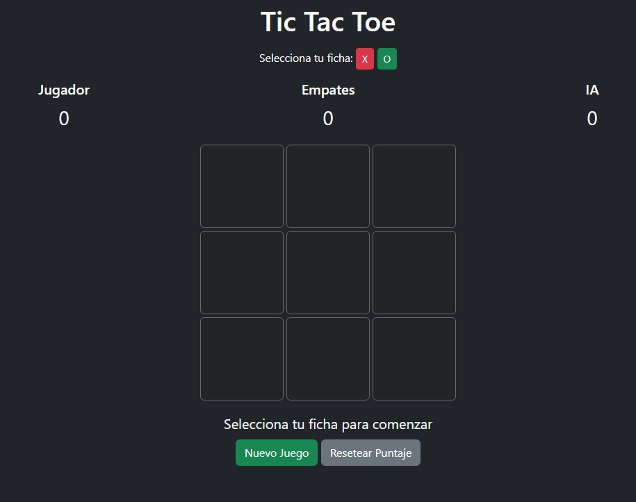

# Tic Tac Toe Node.js + Bootstrap 5



## ¿Cómo usar?

1. Instala dependencias:
```
npm install
```

2. Ejecuta el servidor:
```
npm start
```

3. Abre [http://localhost:3000](http://localhost:3000) en tu navegador.

- **El puntaje se guarda en `data/score.json` automáticamente.**
- **La lógica del juego y la IA están en `public/js/`.**
