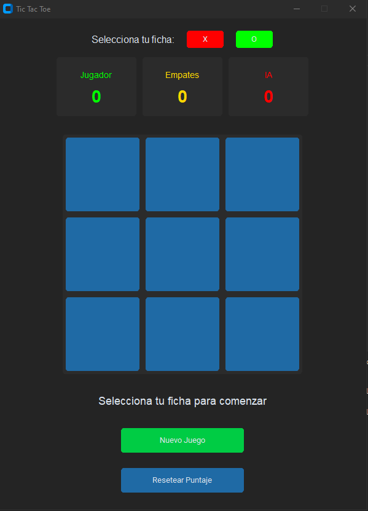

# Tic Tac Toe



## Descripción

Este es un juego de **Tic Tac Toe** (Tres en línea) desarrollado en Python con una interfaz gráfica moderna usando [CustomTkinter](https://github.com/TomSchimansky/CustomTkinter).  
Permite jugar contra la computadora, elegir tu ficha (X u O), y guarda el puntaje de manera persistente.

---

## ¿Cómo se usa?

1. **Ejecuta el programa** desde la terminal:
   ```bash
   python main.py
   ```

2. **Selecciona tu ficha** (X u O) al iniciar cada partida.
   - Si eliges X, tú comienzas.
   - Si eliges O, la IA comienza.

3. **Juega** haciendo clic en las casillas del tablero.

4. El **puntaje** se guarda automáticamente en el archivo `puntaje.json`.

5. Puedes reiniciar el juego o resetear el puntaje usando los botones correspondientes.

---

## Estructura de Carpetas

```
tictactoe/
│
├── main.py
├── gui/
│   ├── __init__.py
│   └── app.py
├── logic/
│   ├── __init__.py
│   └── game.py
├── data/
│   ├── __init__.py
│   └── score_manager.py
├── ingame.png
└── puntaje.json
```

- **main.py**: Punto de entrada del programa.
- **gui/**: Todo lo relacionado con la interfaz gráfica.
- **logic/**: Lógica del juego y de la IA.
- **data/**: Manejo de guardado y carga de puntaje.
- **ingame.png**: Imagen de ejemplo del juego en ejecución.
- **puntaje.json**: Archivo donde se guarda el puntaje (se crea automáticamente).

---

## Requisitos

- Python 3.8 o superior
- [CustomTkinter](https://github.com/TomSchimansky/CustomTkinter)

Instala CustomTkinter con:
```bash
pip install customtkinter
```
